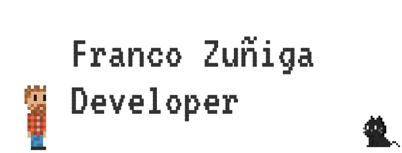

# Franco Agustin Ojeda Zuñiga 💻

## Hola soy franco, Estudiante en la Facultad de Informatica, Backend Developer, Administrador de Linux.  

Hola soy franco, Estudiante en la Facultad de Informática, Full Stack Developer y Administrador de Linux.
Soy programador web autodidacta, actualmente me estoy enfocando en backend, pero tengo y actualizo mis conocimientos sobre frontend. Me interesa el mundo linux y el open source es por eso que comencé la Tecnicatura en Administración de Sistemas y Software Libre. 

Unas de las cosas que me gustan del Open Source es el hecho de que posee un enfoque científico a la hora de programar, beneficiando la industria y la tecnología. Es por esto que este perfil, contendrá ejemplos, proyectos, y cursos sobre el mundo de la programación web y linux. 

   

## Estadisticas

---

## Lenguajes

